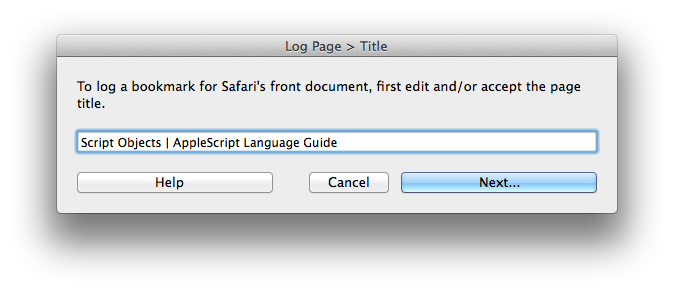
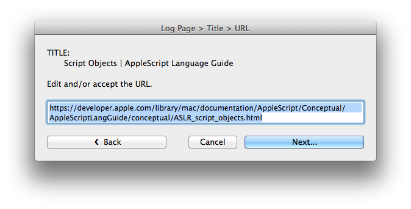
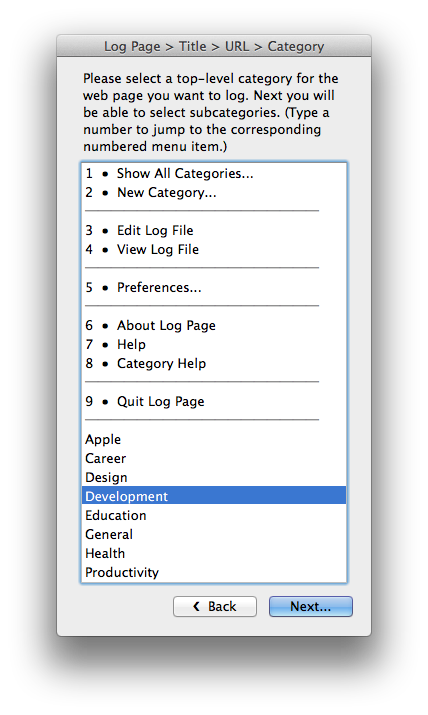
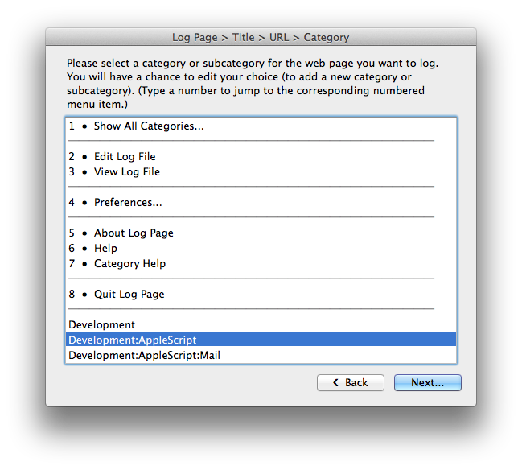
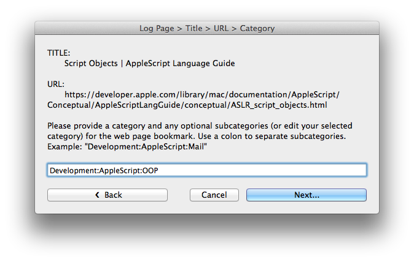
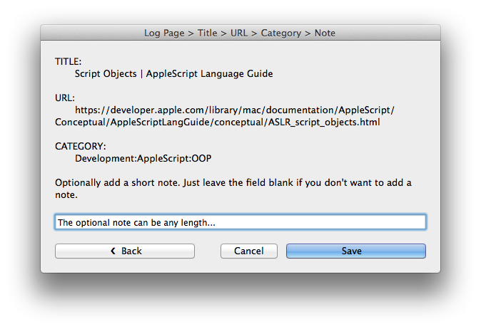
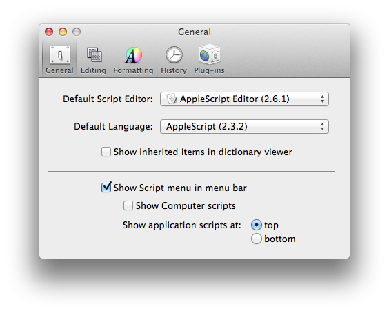

Log Page
========

[Log Page][website] is an AppleScript program for Mac OS X that logs the title
and URL of the frontmost web browser window along with the current date and
time, a user-definable category, and an optional note to a plain text file. The
result is a categorized, chronological, plain text list of bookmarks --- a
bookmarks log. Supported browsers: Safari, Google Chrome, Firefox, and WebKit
Nightly.


Why
---

So what purpose does this script serve? Why not use a web browser's built-in
bookmarking features? Well, you can still use a browser's built-in bookmarking
too (I do), but this script does things a little differently and has a few
conveniences that aren't available with browser bookmarks:

* The bookmarks log file is plain text. Plain text files are future-proof and
  easy to search, read, and edit.

* With this script there's no need to drill down into browser bookmark
  folders looking for a good place to file a bookmark. Instead of a folder
  hierarchy, an alphabetical list of sorted categories/subcategories is
  displayed to choose from.

* The bookmarks are timestamped and organized in chronological order so it's
  easy to see groups of bookmarks that you saved at around the same time when
  you were working on a particular project, similar to an activity log.

* The free-form notes field for a bookmark can be any length.

* The bookmarks log file can be stored on a cloud storage service (it's just a
  simple plain text file) so that it's available to search and edit on mobile
  devices.


Features
--------

* Edit the web page title before logging the page.

* Edit the URL before logging the page.

* Choose from existing categories/subcategories or define a new one without
  having to drill down in a browser's bookmark folder hierarchy.

* The chosen category will become the default for next time.

* Add an optional note to the bookmark.

* Choose a location to save your bookmarks log file using the preferences
  dialog if you don't want to use the default location. (Maybe keep it with
  your other plain text GTD files.)

* View the bookmarks log file in the viewer of your choice (defined in the
  preferences).

* Edit the bookmarks log file in the editor of your choice (defined in the
  preferences).

* Unicode characters in web page titles and the note field are automatically
  transliterated to ASCII.


Bookmarks Log File Format
-------------------------

The bookmarks log file is a simple plain text file consisting of an optional
commented file header plus a list of bookmark records, each record consisting
of two columns --- field name (key) and value. The file can optionally include
a list of sample categories that will be presented in list dialogs even if they
haven't been used in a bookmark record yet. The following is an example
bookmarks file that shows a file header, optional sample categories, and a few
bookmark records:

```
################################################################################
#
# Optional file header consisting of lines beginning with a "#" character. This
# section could be used for collecting general notes about the file and is
# populated by default with some help info.
#
# The bookmark records begin with the first "------+----..." record delimiter.
#
# In between the file header and the first bookmark record, some sample
# categories can be defined so that they will be presented in the category list
# dialogs even if they haven't been used yet in a bookmark record.
#
################################################################################
Label | Development
Label | Development:Algorithms
Label | Development:Compilers
Label | Design:Web:CSS
Label | Design:Web:SVG
Label | Productivity:GTD
Label | Apple:Mac OS X
Label | Development:Perl:OOP
------+-------------------------------------------------------------------------
Date  | 2013-02-28 20:14:38
Label | Example Category:Subcategory:Another Subcategory
Title | Example Web Page Bookmark Record
URL   | http://example.com
Note  | An optional note. It will be automatically line-wrapped if it's longer
      | than 80 characters.
------+-------------------------------------------------------------------------
Date  | 2014-12-23 18:41:17
Label | Development:AppleScript
Title | Log Page - AppleScript for Plain Text, Timestamped, Categorized Web Bookmarks
URL   | http://jazzheaddesign.com/work/code/log-page/
------+-------------------------------------------------------------------------
Date  | 2014-12-23 18:42:45
Label | Development:AppleScript:Safari
Title | Resize Window - AppleScript for Mac OS X That Quickly Resizes Windows
URL   | http://jazzheaddesign.com/work/code/resize-window/
------+-------------------------------------------------------------------------
Date  | 2014-12-23 18:43:11
Label | Development:Shell:Bash
Title | shmark - Categorized Shell Directory Bookmarking for Bash
URL   | http://jazzheaddesign.com/work/code/shmark/
------+-------------------------------------------------------------------------
```


Usage
-----

The following is the basic sequence to save a bookmark for a web page using Log
Page.

The initial dialog (except on the very first run of the script where you can
set some initial preferences) displays the web page title that you can either
edit or accept as is.

  

The URL dialog lets you edit the URL or accept it as is.

  

Next you choose a top-level category for your bookmark. Limiting the first
category dialog to just root categories like this really saves time (less
scrolling) if you have lots of subcategories. You'll also see other actions you
can take such as viewing some script help or info, setting preferences, editing
or viewing the bookmarks log file, or just creating a brand new category if you
know you haven't already defined one that's applicable.

  

The next dialog shows all the subcategories under the top-level category that
you selected in the previous dialog. If you don't see an applicable
subcategory, just select any category since you'll be able to edit your
selection in the next dialog.

  

Accept the category/subcategories that you selected or edit to create a new
category/subcategory.

  

Add an optional note. The note can be any length; just keep typing. The note
will be automatically line-wrapped if necessary before it is written to the log
file.

  

Click the Save button and your new bookmark will be written to your bookmarks
log file. Additionally, the category/subcategory that you selected will be the
default the next time you run the script. That's a real time saver when saving
a bunch of bookmarks on a particular subject because you can repeatedly hit the
Return key to quickly cycle through the dialogs. You'll also notice that there
is always a Back button to take you back to the previous dialog. You can keep
going back all the way to the first dialog.


Installation
------------

### Compile and Install the Script

To compile and install the script, `cd` into the directory containing the
source code and run:

```bash
$ make
$ make install
```

That uses `osacompile` to create a compiled AppleScript named "Log Page.scpt"
from the source file and installs it in a
`~/Library/Scripts/Applications/Safari` directory. It also installs an alias to
that script in script directories for all of the other supported browsers. To
only install the script for specific web browsers, run any of the following
install commands:

```bash
$ make install-safari
$ make install-chrome
$ make install-firefox
$ make install-webkit
```

### Enable the Script Menu

If you're not already using a third-party script runner, enable Apple's Script
menu. The procedure for enabling the menu is different depending on which
version of Mac OS X you're running. For Snow Leopard (10.6) and later, it is a
preference setting in the AppleScript Editor app called "Show Script menu in
menu bar":

  


Development
-----------

Although the primary function of this script is pretty basic, the user
interface consists of many different AppleScript dialog windows (only a few are
shown above) along with full navigation history between those dialogs. To keep
everything maintainable, the script was written using Model-View-Controller
(MVC) and other object-oriented design patterns. Additionally, a custom GUI
AppleScript test suite is included with the source code for running
fully-automated integration tests (over 1,100 currently).

For more developer notes, see the [dev/README] file.


Bugs
----

Please report any bugs using the GitHub [issue tracker].


Credits
-------

Log Page was written by [Steve Wheeler](http://swheeler.com/).


License
-------

Copyright &copy; 2011--2016 Steve Wheeler.

This program is free software available under the terms of a BSD-style
(3-clause) open source license. See the [LICENSE] file for details.


  [website]: http://jazzheaddesign.com/work/code/log-page/
  [issue tracker]: https://github.com/jazzhead/log-page/issues
  [LICENSE]: LICENSE
  [dev/README]: dev/README.md
